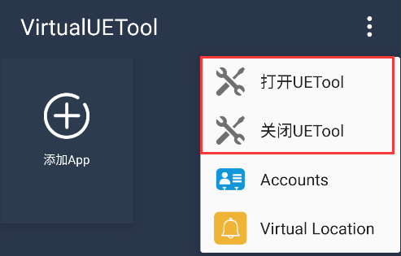
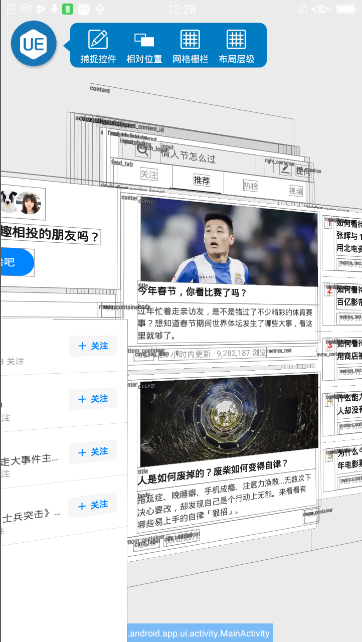

VirtualUETool [](https://developer.android.com/index.html)
======

>**UETool's extension. Show/edit any view's attributions, any app.**


## 介绍

VirtualUETool 扩展自[UETool](https://github.com/eleme/UETool)实现，底层基于[VirtualApp](https://github.com/asLody/VirtualApp)的实现。可以作用于**任何App**在屏幕上显示的 view，比如 Activity/Fragment/Dialog/PopupWindow 等等。

目前 VirtualUETool 基本可实现 UETool 的所有功能,可直接查看已安装APP：

- 移动屏幕上的任意 view，如果重复选中一个 view，将会选中其父 view
- 查看/修改常用控件的属性，比如修改 TextView 的文本内容、文本大小、文本颜色等等
- 如果你的项目里正在使用 Fresco 的 DraweeView 来呈现图片，那么 UETool 将会提供更多的属性比如图片 URI、默认占位图、圆角大小等等
- 你可以很轻松的定制任何 view 的属性，比如你想查看一些额外的业务参数
- 有的时候 UETool 为你选中的 view 并不是你想要的，你可以选择打开 ValidView，然后选中你需要的 View
- 显示两个 view 的相对位置关系
- 显示网格栅栏，方便查看控件是否对齐
- 新增支持查看布局层级
- 功能扩展中...

[下载体验](https://github.com/zhangke3016/VirtualUETool/blob/master/app-release.apk?raw=true)

## 效果



### 新增查看布局层级



## 自定义实现你的 View 的属性

注意：自定义实现View 的属性时，与 **[UETool](https://github.com/eleme/UETool)** 的方式一致

#### 

```java

// step 1, implements IAttrs

public class UETFresco implements IAttrs {
  @Override public List<Item> getAttrs(Element element) {

  }
}

// step 2, put in UETool  must in  MyComponentDelegate.beforeApplicationCreate

UETool.putAttrsProviderClass(Class customizeClazz);

UETool.putAttrsProviderClass(String customizeClassName);

```
需在`MyComponentDelegate.beforeApplicationCreate`方法内调用，保证在每个App的独立进程中生效

## Thanks
[UETool](https://github.com/eleme/UETool)

[CmProcess](https://github.com/zhangke3016/CmProcess)

[VirtualApp](https://github.com/asLody/VirtualApp)

[VirtualXposed](https://github.com/android-hacker/VirtualXposed)

### About me

A Android Developer in ShenZhen.

【[**我的简书地址**](http://www.jianshu.com/users/3c751e06dc32/latest_articles)】

【[**我的CSDN地址**](http://blog.csdn.net/zhangke3016)】
